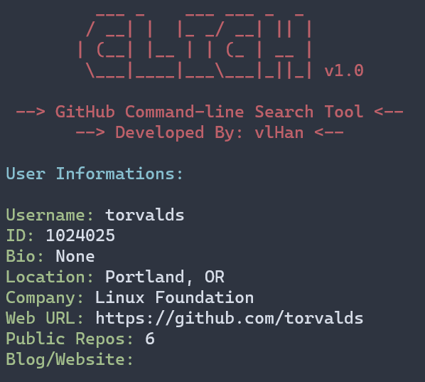
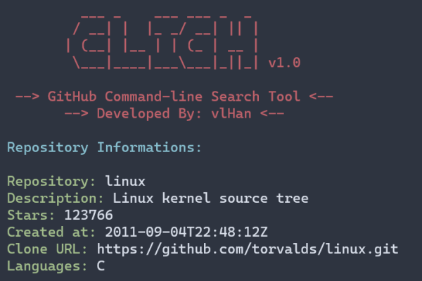

# cligh

<p>
    
   
   
</p>


cligh is a command-line search tool for GitHub.


## Installation

Clone this repository: `git clone https://github.com/vlHan/cligh` or <a href="https://github.com/vlHan/cligh/archive/refs/heads/main.zip">download zip</a>
- Enter the folder: `cd cligh/` or run out of the diretory.
- Install python3 
  - Linux
    - `sudo apt-get install python3`
    - `chmod +x *`
    - `python3 -m pip install -r requirements.txt`
    - Finished!

  - Windows and Mac
    - [Python 3, download and install](https://www.python.org/downloads/)
    - `python -m pip install -r requirements.txt`
    - Finished!

## Usage
```py
# usage (out of the diretory): 
python3 cligh -u 'GithubUsername'
        cligh -u 'GithubUsername' -r 'RepositoryName'

examples: 

# see informations about a profile 
python3 cligh -u 'vlHan'

# see informations about a repository
python3 cligh -u 'vlHan' -r 'cligh'
```

### Userprofile Search



### Repository Search



## License
This project is under [MIT License](LICENSE)

